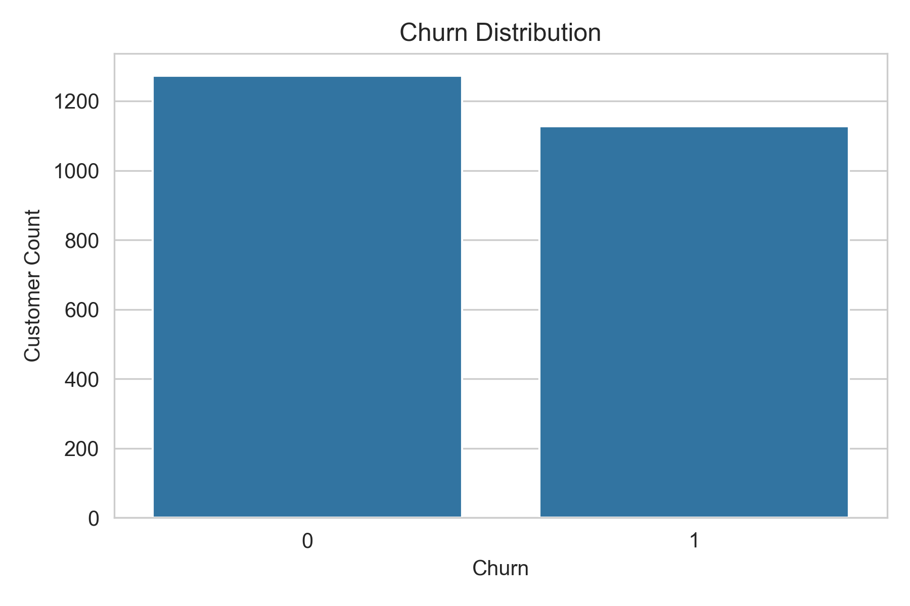
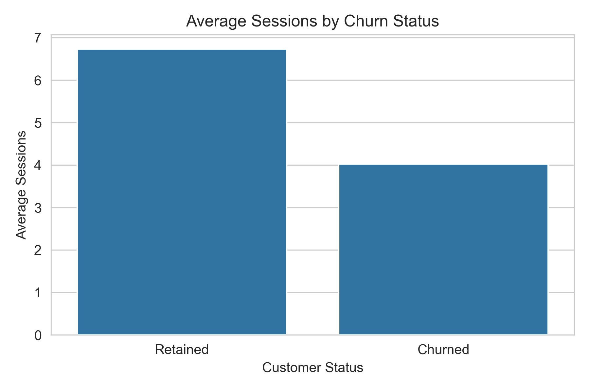
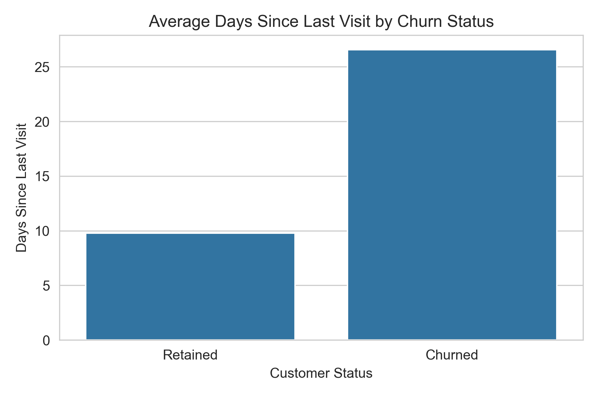

# D2C Customer Churn Intelligence

## Part 1: Data Audit, EDA & Business Understanding


---

# Project Overview

Customer churn is one of the most critical business challenges for Direct-to-Consumer (D2C) companies. Before building machine learning models or designing retention strategies, it is essential to understand customer behavior, validate data quality, and identify patterns associated with churn.

This project performs a complete data audit and exploratory analysis of customer, transaction, support, engagement, campaign, and churn datasets to uncover business insights and churn-risk indicators.

### Objective

Identify behavioral patterns associated with customer churn and provide evidence-based recommendations for future retention initiatives.

### Prediction Target

Predict whether a customer will churn within the next **60 days**.

### Snapshot Date

**2025-09-30**

---

# Business Problem

The company faces significant customer attrition but lacks visibility into:

* Why customers stop purchasing
* Which engagement signals indicate churn risk
* Which customer segments require intervention
* What business actions should be prioritized before launching retention campaigns

This analysis addresses these questions using customer-level behavioral and operational data.

---

# Analytical Questions

This analysis aims to answer the following questions:

1. What data quality issues exist in the available datasets?
2. How do customers interact with the platform?
3. What purchasing behaviors are associated with churn?
4. Which engagement metrics best explain customer attrition?
5. Which customer segments should be prioritized for retention campaigns?
6. What business actions should be taken before predictive modeling?

---

# Dataset Summary

| Dataset              | Description                                  | Records |
| -------------------- | -------------------------------------------- | ------: |
| customers            | Customer profile and demographic information |   2,400 |
| orders               | Historical order transactions                |  10,009 |
| support_tickets      | Customer support interactions                |   1,921 |
| web_events_snapshot  | Customer engagement metrics                  |   2,400 |
| intervention_history | Marketing and campaign history               |   2,400 |
| churn_labels         | Churn outcomes and dataset split information |   2,400 |

All datasets are linked through a common customer identifier:

```text
customer_id
```

---

# Analysis Workflow

## Phase 1 – Data Audit

Performed:

* Missing value assessment
* Duplicate and duplicate-like record detection
* Invalid value validation
* Outlier detection
* Join integrity validation
* Date consistency assessment
* Target leakage identification

---

## Phase 2 – Exploratory Data Analysis

Exploration was conducted across:

### Customer Profile Analysis

* Age groups
* City tiers
* Acquisition channels
* Loyalty membership
* Preferred categories

### Order Analysis

* Purchase frequency
* Order value distribution
* Product returns
* Customer ratings
* Delivery performance

### Support Analysis

* Issue categories
* Resolution times
* Customer sentiment
* Ticket reopen rates

### Web Activity Analysis

* Sessions
* Product views
* Cart activity
* Email engagement
* Campaign clicks
* Customer recency

### Campaign Analysis

* Campaign exposure
* Priority segmentation

### Churn Analysis

* Churn distribution
* Customer-level churn comparisons
* Churn-risk hypothesis testing

---

# Sample Visualizations

## Churn Distribution



---

## Session Activity vs Churn



---

## Customer Inactivity vs Churn



---

# Key Findings

## Strongest Churn Drivers

| Rank | Driver                | Strength    |
| ---- | --------------------- | ----------- |
| 1    | Days Since Last Visit | Very Strong |
| 2    | Session Activity      | Very Strong |
| 3    | Purchase Frequency    | Strong      |
| 4    | Campaign Engagement   | Strong      |
| 5    | Return Rate           | Moderate    |

---

## Hypothesis Summary

| Hypothesis                | Result              |
| ------------------------- | ------------------- |
| Low Order Frequency       | Supported           |
| Low Session Activity      | Supported           |
| High Inactivity (Recency) | Supported           |
| Loyalty Tier              | Partially Supported |
| High Return Rate          | Supported           |
| Negative Sentiment        | Not Supported       |
| Low Campaign Engagement   | Supported           |
| Reopened Tickets          | Not Supported       |

---

# Executive Summary

### Customers Who Churn:

* Visit the platform less frequently
* Place fewer orders
* Show lower campaign engagement
* Remain inactive for longer periods
* Exhibit slightly higher return rates

### Customers Who Stay:

* Visit more frequently
* Purchase more often
* Engage with campaigns
* Maintain consistent platform activity

The strongest predictor of churn observed during analysis was customer inactivity.

---

# Business Recommendations

## Priority 1 – Monitor Customer Inactivity

Customers who stop visiting the platform should be identified early and targeted through re-engagement campaigns.

### Suggested Actions

* Personalized email campaigns
* Product recommendations
* Cart recovery programs
* Time-sensitive offers

---

## Priority 2 – Retain Low-Frequency Buyers

Customers showing declining purchase frequency should receive proactive retention interventions.

### Suggested Actions

* Loyalty incentives
* Personalized discounts
* Repeat-purchase reminders

---

## Priority 3 – Improve Loyalty Program Performance

Gold and Platinum members demonstrated stronger retention than lower-tier customers.

### Suggested Actions

* Improve Silver-tier benefits
* Accelerate progression toward higher tiers
* Introduce exclusive rewards

---

## Priority 4 – Increase Campaign Engagement

Campaign engagement acts as an early warning signal for churn.

### Suggested Actions

* Improve campaign personalization
* Optimize targeting strategies
* Track campaign interaction metrics continuously

---

# Repository Structure

```text
part1-data-audit-eda/
│
├── data/
│
├── notebooks/
│   └── eda_audit.ipynb
│
├── outputs/
│   ├── charts/
│   └── tables/
│
├── reports/
│   ├── business_memo.md
│   └── data_quality_report.md
│
├── README.md
├── requirements.txt
└── .gitignore
```

---

# Deliverables

## Notebook

### notebooks/eda_audit.ipynb

Contains:

* Data loading
* Data quality audit
* Exploratory analysis
* Customer-level feature aggregation
* Churn analysis
* Eight churn-risk hypotheses
* Business interpretation

---

## Reports

### reports/data_quality_report.md

Includes:

* Missing value analysis
* Duplicate detection
* Outlier assessment
* Join validation
* Leakage risks
* Recommendations

### reports/business_memo.md

Includes:

* Executive findings
* Retention priorities
* Business recommendations

---

# Generated Outputs

## Charts

```text
outputs/charts/
```

Contains all generated visualizations used during analysis.

## Tables

```text
outputs/tables/
```

Key outputs include:

* dataset_overview.csv
* schema_summary.csv
* missing_values_summary.csv
* churn_distribution.csv
* churn_hypothesis_summary.csv
* key_business_findings.csv
* customer_master_dataset.csv

---

# Technologies Used

* Python
* Pandas
* NumPy
* Matplotlib
* Seaborn
* Jupyter Notebook

---

# Conclusion

The analysis indicates that customer churn is primarily driven by declining engagement and increasing inactivity rather than support-related factors.

Customers who stop visiting the platform, purchase less frequently, and interact less with marketing campaigns represent the highest-risk churn segments.

These findings provide a strong foundation for future churn prediction models and targeted retention strategies.
